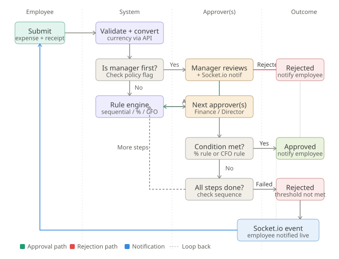

# 💸 Reimbursement Management System

An automated, real-time enterprise expense management platform built in 8 hours for [Insert Hackathon Name]. 

This system eliminates manual expense tracking by introducing a dynamic, multi-level approval engine, strict Role-Based Access Control (RBAC), and real-time Socket.io notifications.

## 🚀 Tech Stack
* **Frontend:** React, Tailwind CSS, Vite
* **Backend:** Node.js, Express.js
* **Database:** PostgreSQL
* **Real-time:** Socket.io
* **Security:** JWT Authentication

---

<p align="center">
  
</p>

--- 

## ⚙️ Core Architecture & Approval Workflow
Our backend features a robust, state-machine-like rule engine that handles complex organizational hierarchies. 

1. **Submission & Processing:** * **Employee** submits an expense claim and receipt.
   * **System** immediately validates the data and automatically converts the currency to the company's default standard via external API.
2. **Policy Routing:**
   * The system evaluates the **"Is Manager First?"** policy flag. If active, it routes directly to the direct manager.
   * A **Socket.io** event pushes a live notification to the manager's dashboard.
3. **Dynamic Rule Engine:**
   * If the manager approves (or if the manager step is skipped), the expense enters the **Rule Engine**.
   * The engine processes **Sequential Steps** (e.g., Finance $\rightarrow$ Director).
   * It evaluates **Custom Conditions**, such as:
     * **Percentage Rule:** (e.g., Requires 60% of assigned approvers to agree).
     * **Override Rule:** (e.g., Immediate approval if the CFO signs off).
4. **Final Resolution:**
   * **Approved:** If conditions are met, the expense is finalized.
   * **Rejected:** If a manager rejects it, or if a threshold fails, it is immediately marked as rejected.
   * **Live Loopback:** In all final outcomes, a Socket.io event triggers a live notification back to the employee, updating their ledger without a page refresh.

---

## ✨ Key Features

* **Strict Role-Based Access Control (RBAC):** Secure JWT session persistence ensures Employees, Managers, and Admins are strictly isolated to their specific dashboard views and API endpoints.
* **Real-Time Live Notifications:** Integrated Socket.io rooms push status updates instantly across the platform.
* **Complex Workflow Builder:** Admins can visually configure approval rules (Sequential, Percentage-based, or Specific Approver) directly from their dashboard.
* **Live Analytics:** A data-backed dashboard aggregating pending capital, approved expenses, and system bottlenecks using relational PostgreSQL queries.

---

## 🛠️ Local Setup & Installation

**1. Clone the repository**
```bash
git clone [https://github.com/Aditya2550/Reimbursement-Management.git](https://github.com/Aditya2550/Reimbursement-Management.git)
cd Reimbursement-Management